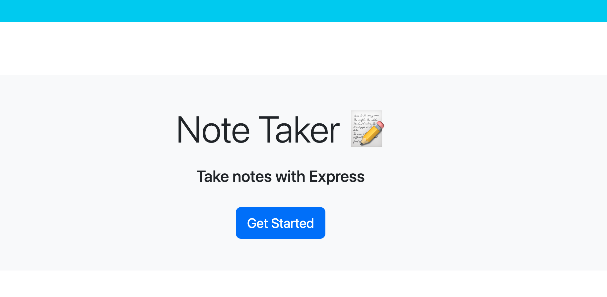
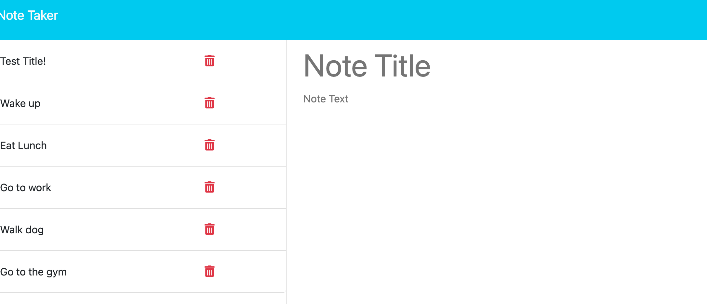
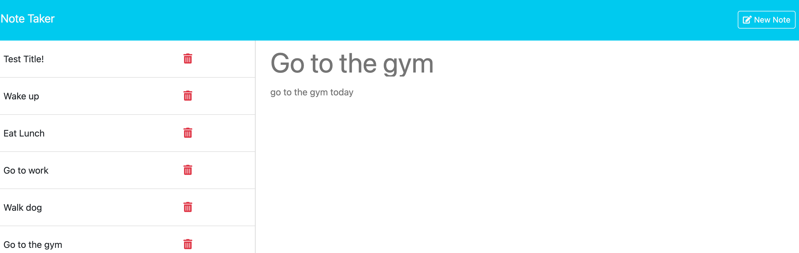

# ExpressJSNoteTaker

## Description 

The motivation behind the project was to create a website using express js with node where a user can save and write notes about activities throughout their day or any information they'd like to save. We built this application because it creates a website that is easy for users to use and navigate in order for them to organize their notes simply by saving their data to a json file. It solves the problem of functionality and creating an application with both the front end and back end that allows users to easily organize/seperate their notes on one page. I learned a lot about creating get, post and delete routes, and having different files in my code to work together and function properly.

## Installation 
First you have to run "npm init -y" to retrieve the package.json file (already provided in starter code)
Then you type in "npm i express" to install express in order to use it on the backend 
Type in "npm run start" to run the application and access the webpage

## Usage

Instructions for ![Homepage(Index.html)]: When you type in http://localhost:80, this will take you to the home page where you can click get started to take you to the notes page 
Instructions for ![TypeinNote]: Under Note Title and Note Text, type in your desired notes and click on the "Save Note" button to save the note  
Instructions for ![SavedNoteAppears]: Your saved note will then appear on the left hand column with all your previously saved notes 
Instructions for ![SavedNoteOnRight]: When you click on your saved note on the left hand side, it will appear in the right column with an option to create a new note if you click on the button 

## Credits 

ASKBCS was a source of guidance and super helpful in answering a few questions for this assignment (errors in code)

## License 

Please refer to the LICENSE in the repo 